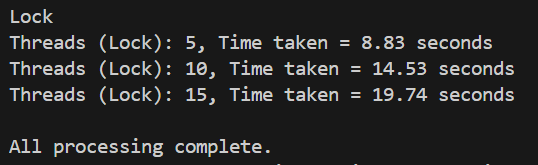
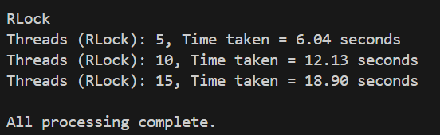
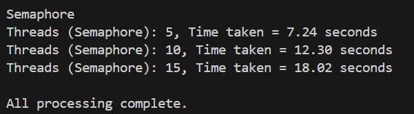

### Multithreading with Lock
Lock is a simple mutex that only allows one thread to enter the critical section at a given moment.

### Multithreading with RLock
RLock (Re-entrant Lock) allows for the same thread to acquire the critical section multiple times, it is usually used in programs that use recursion or nested calls, etc.

### Multithreading with Semaphore
Semaphore is a kind of mutex that allows for N number of threads to acquire the critical section at once.

As it can be seen, the order of speed is as follows:
RLock > Semaphore > Lock

