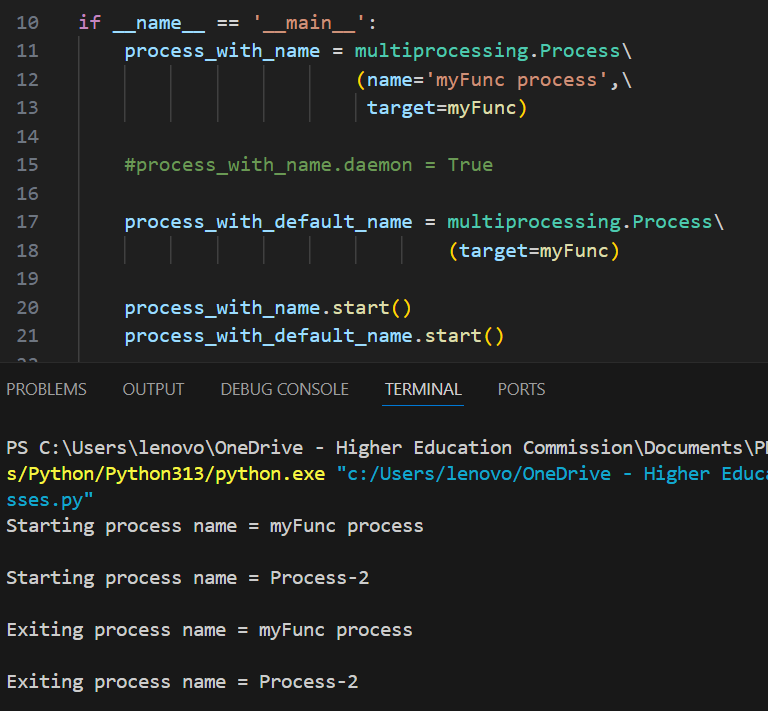
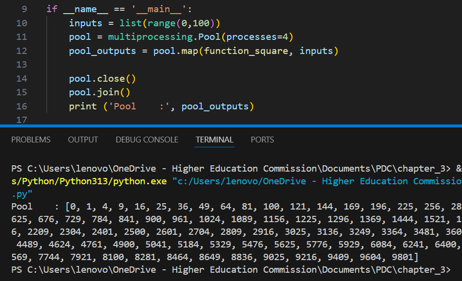
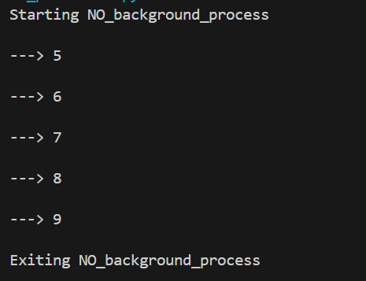
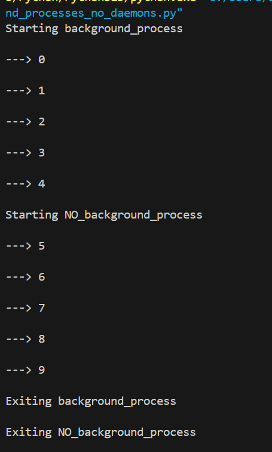
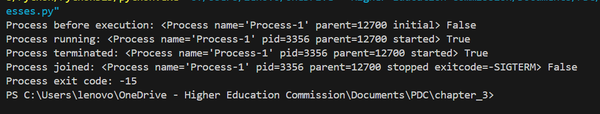

# Naming Processes
The computer recognizes each process via it's process ID, while this is a very efficient way for machines to remember the process, humans who might need to interact with said process require more context. Naming processes in a suitable manner helps the user to identify which process does what. The following is an example of a named process:

# Process Pool
To save time and increase throughput, the processor uses a pool of pre-spawned processes that are already started and waiting for incoming work. They work concurrently and allow for parallel computing. The following is an example which spawns 4 processes and uses them to quickly calculate the squares of numbers 1 - 100:

# Background Processes
**Daemon**: Daemon in this context refers to the idea that if a process has daemon enabled, it's parent shouldn't wait for it to finish and terminate when it's own work is done. This results in the child to also terminate abruptly, uncleanly and sometimes causing serious bugs and issues.

When it comes to background processes, the ones with daemon turned true, there parents die, before the child even has a chance to do it's job, hence we don't see any output from that where as the independent foreground processes run and finish there task and exit cleanly as shown below:

However, the background process with no daemon turned own, run perfectly fine, because there parent process waits for them to finish there work before terminating:

# Killing Processes:
The processes with no daemon whose parents terminate but the child processes remain active are adopted by the init process but sometimes these processes become zombies and have trouble terminating. These processes need to be terminated manually, hence killing processes:
