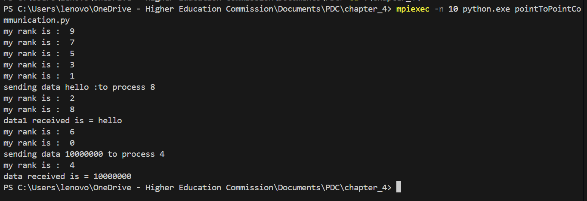
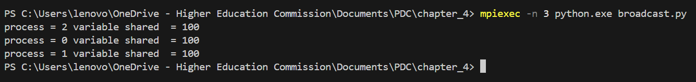
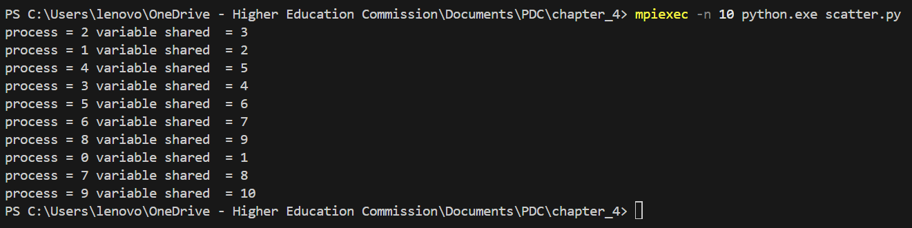
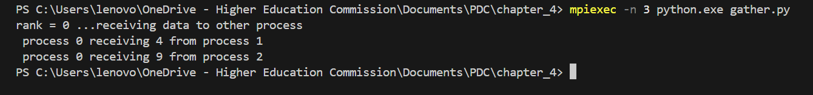
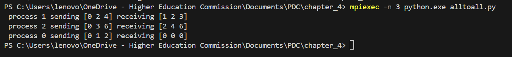
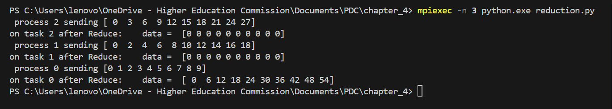
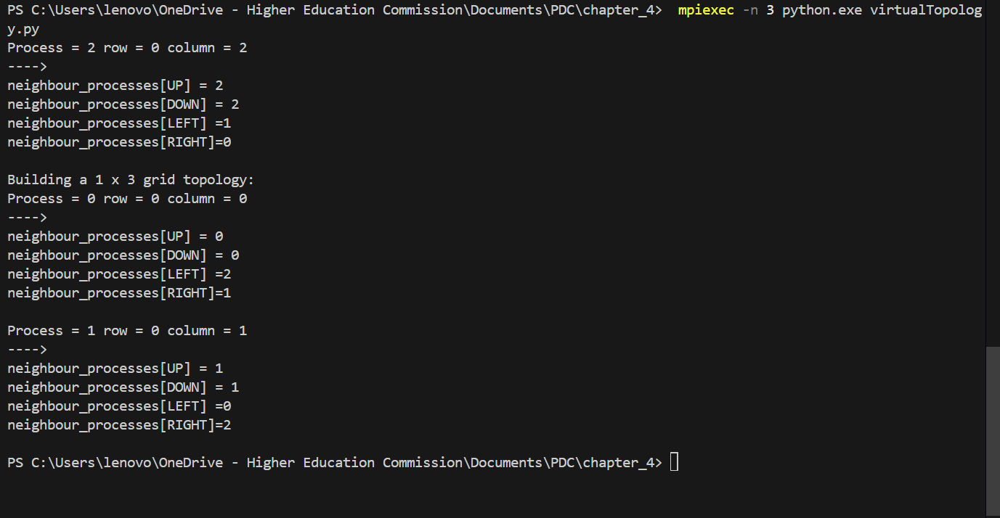
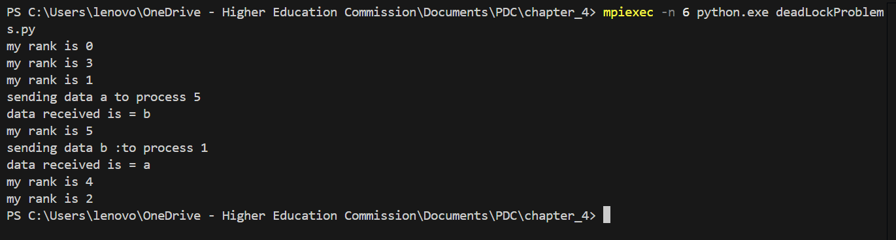

# MPI
MPI or Message passing interface is a protocol that allows processes to communicate with each other via messages instead of shared memory or semaphores. It is primarily used in tasks where the problem can be divided into smaller chunks that remain mostly independent.

MPI gives multiple methods to communicate with processes. Some of these are mentioned below:

1. Point to Point Communication:
As the name suggest, this method allows for one particular process to communicate with another process directly. 

2. Broadcast:
This methods allows for one process to share its data with all other processes.

3. Scatter:
This method allows processes to split the data they have and share it with other processes, allowing for increased throughput.

4. Gather:
Gather is the reverse of scatter, instead of distributing data to other processes, it collects data from multiple processes.

5. All to All:
This method allows all processes to every other process, this method is generally used in problems where matrices are involved.

6. Reduction:
Reductions are a set of methods that provide aggregate values for a large data, or multiple sources of data. This aggregate data is stored in the root.

7. Virtual Topology:
By default MPI creates and knows processes as arrays, ranks are given incrementally, however, Virtual Topology creates a cartesian plane or a 2d structure to processes. This functionality might be usable in some neural network, etc.

8. DeadLock Problems:
In MPI, deadlocks can be reached in a few situations, one of these situations is the one where process A sends data to process B, but Process B has also sent data to A, and both are waiting to recieve. 

