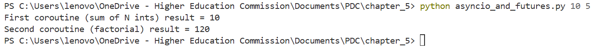
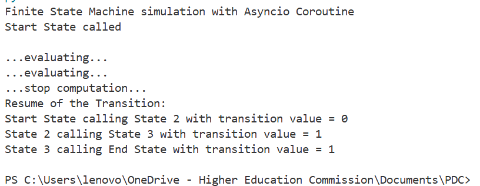
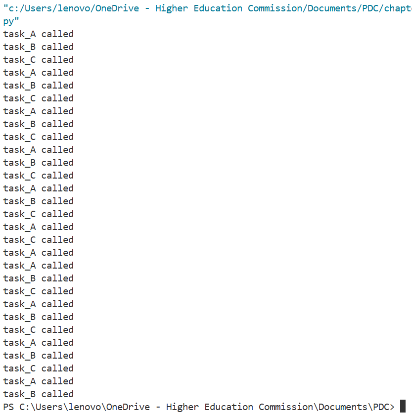
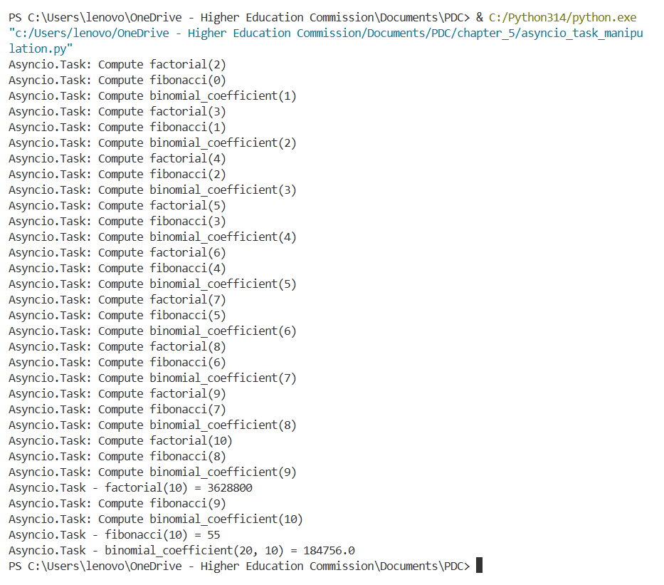
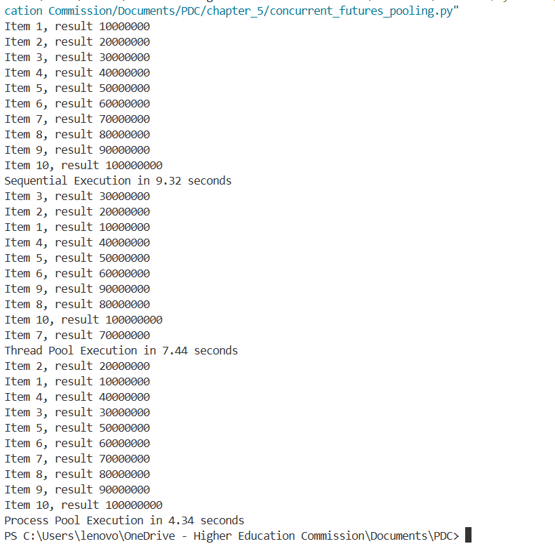

# Asynchronous Programming

## Futures and Co-Routines:
Co-Routines are special Methods that can pause and resume their execution at will. It doesn't necessarily run to completion immediately.

Futures represent values that will exist later. Futures and Co-routines are usually used together as the co-routine returns a result that might exist later in time. 

The above image shows the output of two co-routines that ran concurrently.

Another Example of Co-Routines:

## Event Loops:
Event loops are the core of Asynchronous Programming. They are task schedulers that run coroutines, callbacks, timers, etc one at a time and switch between them when await is called.

An Example of Event Loops output is given as follows, where three co-routines go to sleep for random times and call the other coroutine after waking up, Hence it goes like:
A -> sleep -> wake -> B -> sleep -> wake -> C -> sleep -> wake -> A
this loop ran for 60 seconds.

Another More Contextful and easy to understand example for event loops is the use of mathematical tasks. These are performed concurrently on the same CPU and each task takes turns and executes its part and then go to sleep and waits for the next one. As shown below:

## Future Pooling

It is the same concept as Process Pooling, futures pooling is a way to run many tasks efficiently by submitting them to a managed pool of threads or processes and receiving their results through Future objects.

A Comparison between some concurrency techniques and Future Pooling is given as follows:

