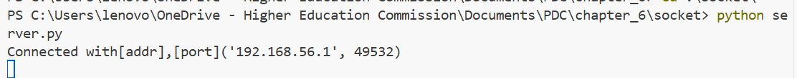
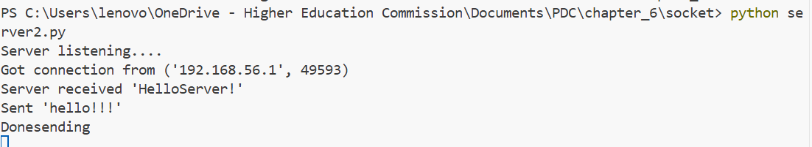
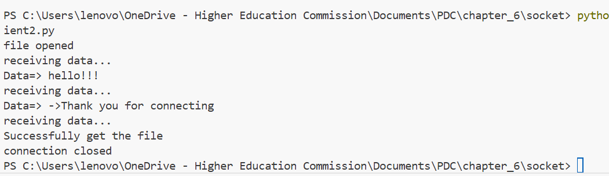

# Distributed Python
When it comes to Distributed Computing, python can be used in the following architectures.
    1. Client-Server Architecture
    2. Multi-Level Architecture

## Client-Server Architecture
Client–server architecture models computation as a separation between requesters (clients) and service providers (servers). In parallel and distributed computing, this abstraction enables concurrent handling of many requests and the distribution of server responsibilities across multiple nodes for scalability and efficiency.

Another Example with Data Transfer:

